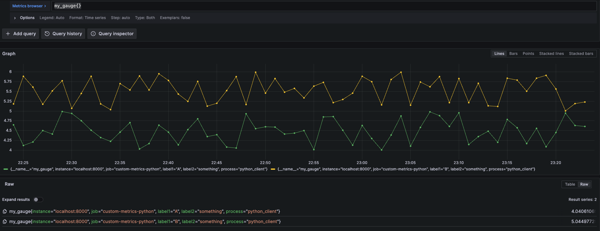

# Simple Prometheus Python Client example

This is a simple Prometheus Python client example. It is inspired by the [Three Step Demo](https://prometheus.github.io/client_python/getting-started/three-step-demo/) from the Python Client documentation, with a few additions. 

## Python script description

It creates metrics of different types (Counter, Gauge, Summary, Histogram) with random values, illustrating a few different concepts. 

The script is doing the following:

Creating the metric objects, which names are:

- my_counter
- my_gauge
- request_processing_seconds
- my_histogram

The script starts the python client http server that will be exposing metrics on port 8000. It then start an infinite loop that are simulating request processing and also generate values for the metrics.

`my_gauge` has 2 labels attached (`label1` and `label2`) and `label1` has 2 distinct values (`A` and `B`). `label1=A` will have random values between 4.0 and 5.0. `label1=B` will have random values between 5.0 and 6.0

`request_processing_seconds` will record random processing time (betwen 0.0 and 1.0), simulated by a `sleep()` function call. The `Summary` class provides a `time()` function we use as a decorator for the `process_request()` function, which simulate request processing time by sleeping for `t` (between 0.0 and 1.0 second). Over a certain period of time the average value will be around 0.5.

`my_counter` is increased by 1 for every loop iteration. Since the processing time averages around 0.5 second, the counter will increase at an average rate around 2 per second. 

`my_histogram` will record values between 0.0 and 100.0 into 10 different buckets.

## How to use the script

You first need to install the Python client:

```pip install prometheus-client```

Then you run the script:

```python ./simple-python-client.py```

You can visit `http://localhost:8000/` to view the metrics.

To scrape the metrics, add a job in your Prometheus or Grafana agent config, for example:

```
    scrape_configs:
    - job_name: custom-metrics-python
      static_configs:
        - targets: ['localhost:8000']
          labels:
            process: 'simple-python-client.py'
```

Restart Prometheus or the agent.

## Visualizing the metrics in Grafana

Here is what querying the metrics in Grafana should look like.

Query: ```my_gauge{}```



Query: ```rate(request_processing_seconds_sum[$__rate_interval]) / rate(request_processing_seconds_count[$__rate_interval])```


Query: ```rate(my_counter_total[$__rate_interval])```


Queries:
```
histogram_quantile(0.2, rate(my_histogram_bucket[$__rate_interval]))
histogram_quantile(0.5, rate(my_histogram_bucket[$__rate_interval]))
histogram_quantile(0.75, rate(my_histogram_bucket[$__rate_interval]))
histogram_quantile(0.95, rate(my_histogram_bucket[$__rate_interval]))
```

